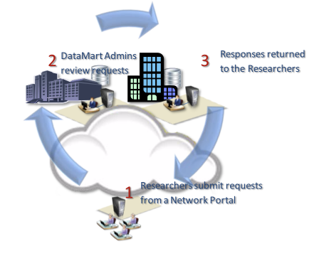

# Summary

PopMedNet&trade; is an open-source application used to facilitate multi-site health data networks [@Brown:2010]. It uses a distributed network design that enables data holders to retain full control of their data. Investigators send questions to data holders for review and response. PopMedNet eliminates the need for assembling patient records in a centralized repository, thus preserving patient privacy and confidentiality.

Its development was pioneered by the Therapeutics Research and Infectious Disease Epidemiology (TIDE) group of the Department of Population Medicine (DPM) of the Harvard Pilgrim Health Care Institute (HPHCI), an appointing department of the Harvard Medical School.

# Statement of need

Distributed health network plays an important role in supporting a number of population health activities [@Brown:2010]. 

The goal of PopMedNet&trade; is to facilitate distributed analysis of electronic health data in order to support medical product safety surveillance, disease surveilance, comparative effectiveness, quality, medical resource use, cost-effectiveness, and related studies. It does this by enabling the creation of health data networks that allows the data owners to keep and control uses of their data, while at the same time allows customized access and governance for each network [@Davies:2016; @Malenfant:2015].

# Architecture

PopMedNet&trade; has two components. It has a .NET web application component and a Windows desktop application component. The .NET web component uses a modern service oriented architecture (SOA) with a robust API serving a dynamic UI using the MVVM pattern. The Windows desktop compoennt, called the DataMart Client, makes use of Entity Framework to dynamically converts queries into SQL for execution in order to support multi-database queries.

PopMedNet&trade; is written in C# on the server side and Typescript on the client side.

# How does PopMedNet&trade; work?

1. Request: Investigators distribute data requests constructed in the point and click web interface
2. Review: Data Partners receive and review requests in their DataMart Client
3. Respond: Data partners execute the requests against their local data and upload results 
4. Download: Investigators access results in the query tool

# Acknowledgements

PopMedNet&trade; [@PopMedNet] was developed and has been extended as part of several contracts awarded by a range of federal, state, and industry stakeholders:

* FDA's Sentinel Initiative
* PCORI’s National Patient-Centered Clinical Research Network (PCORnet)

In addition, Harvard Pilgrim Health Care Institute 
serves as the coordinating center for several other initiatives that use PMN and its associated software ecosystem including:

* Biologics and Biosimilars Collective Intelligence Consortium (BBCIC) 
* Office of the Assistant Secretary for Planning and Evaluation (ASPE) & Food and Drug Administration 
* Privacy-protecting distributed analysis of biomedical big data project funded by  the National Institute of Biomedical Imaging and Bioengineering of the National Institutes of Health

# References

